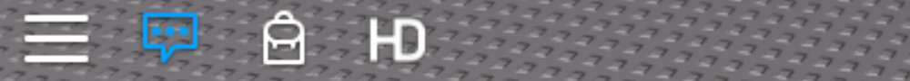

**Important update 2021**

This repository does not reflect the latest code from HD Admin, you can find that instead at the [MainModule](https://www.roblox.com/library/3239236979/HD-Admin-V2-MainModule). 

HD Admin was a passion project I began working on all the way back in 2016, almost 5 years ago now. It’s been overwhelming to see the positive reception and uptake of the application, however to say it was outdated would be a slight understatement.

While I still provide regular bug-fixes/patches for HD Admin, you may have noticed we haven’t added new features or commands for a few years now. This is because over the last 2 years we’ve been working towards a new administration system to release 2021 - Nanoblox. You can follow our progress at [github.com/nanoblox](https://github.com/nanoblox).

~ Ben (ForeverHD)

--------------------

<div align="center">
    
</div>

<div>&nbsp;</div>

**HD Admin** is an open-source admin application for the Roblox platform. It is comprised of an extensive range of features and commands designed to enhance games for both player and developer.

<br>

# Resources
- Creating a command: https://devforum.roblox.com/t/HD/281315
- MainModule: https://www.roblox.com/library/3239236979/HD
- Loader: https://www.roblox.com/library/857927023/HD
<br>

# Tutorials
1. ### [An introduction to HD Admin](https://www.youtube.com/watch?v=8_wMQLJF5ds&list=PLsbxI7NIoTthZXpsd_-_Ab5c0OZ5alA0j&index=1)
2. ### [Setting up Ranks and Specific Users](https://www.youtube.com/watch?v=_M3jZj2H3nc&list=PLsbxI7NIoTthZXpsd_-_Ab5c0OZ5alA0j&index=2)
3. ### [Setting up Gamepasses and Assets](https://www.youtube.com/watch?v=Z3Ni5ilgkTc&list=PLsbxI7NIoTthZXpsd_-_Ab5c0OZ5alA0j&index=3)
4. ### [Setting up Groups](https://www.youtube.com/watch?v=qfGroFXeZ80&list=PLsbxI7NIoTthZXpsd_-_Ab5c0OZ5alA0j&index=4)
5. ### [Setting up Friends, VIP Servers and Free Admin](https://www.youtube.com/watch?v=3RolVPAC-NM&list=PLsbxI7NIoTthZXpsd_-_Ab5c0OZ5alA0j&index=5)
6. ### [Modify System Settings](https://www.youtube.com/watch?v=Lzod5Tbxqi0&list=PLsbxI7NIoTthZXpsd_-_Ab5c0OZ5alA0j&index=6)
7. ### [Adding Custom Morphs and Tools](https://www.youtube.com/watch?v=IpuSOKS1CgM&list=PLsbxI7NIoTthZXpsd_-_Ab5c0OZ5alA0j&index=7)
8. ### [Modify Commands (coming soon)]()
<br>

# API
## Retrieving HD
```lua
local hdMain = require(game:GetService("ReplicatedStorage"):WaitForChild("HDAdminSetup")):GetMain()
local hd = hdMain:GetModule("API")
```

## Key Parameters
- **player** - the player instance (e.g. ``local player = game:GetService("Players").ForeverHD``)
- **rank** - the rankId or rankName (e.g. 1 or "VIP")
- **rankType** - determines the duration the player keeps their rank for:
    - **"Perm"** - for all servers for an infinite period of time
    - **"Server"** - for the server the rank is given in until the server ends
    - **"Temp"** - for the server the rank is given in until the player leaves


## Methods
### Server
#### `hd:SetRank(player, rank, rankType)`
Sets the Rank and RankType for the specified player. Example: `hd:SetRank(player, "Mod", "Perm")`

#### `hd:UnRank(player)`
Sets the Rank to 0 (NonAdmin) and clears the RankType for the specified player. Example: `hd:UnRank(player)`

#### `hd:GetRank(player)`
Returns the rankId, rankName and rankType for the specified player. Example: `local rankId, rankName, rankType = hd:GetRank(player)`

#### `hd:DisableCommands(player, boolean)`
Disables the ability to use commands for the specified player when set to true. Example: `hd:DisableCommands(player, true)`

<br>

### Client
#### `hd:SetTopbarTransparency(number)`
Sets the transparency of the HD Topbar. Example: `hd:SetTopbarTransparency(0.5)`

#### `hd:SetTopbarEnabled(boolean)`
Hides and disables the HD Topbar when set to false. Example: `hd:SetTopbarEnabled(false)`

<br>

### Shared
#### `hd:GetRankName(rankId)`
Returns the corresponding rankName from the given rankId. Example: `local rankName = hd:GetRankName(1)`

#### `hd:GetRankId(rankName)`
Returns the corresponding rankId from the given rankName. Example: `local rankId = hd:GetRankId("VIP")`

#### `hd:Notice(player, message)`
Displays a notification to the specified player. If used on the client, 'player' must be the LocalPlayer. Example: `hd:Notice(player, "Hello world!")'

#### `hd:Error(player, message)`
Displays an error notification to the specified player. If used on the client, 'player' must be the LocalPlayer.. Example: `hd:Error(player, "Error!")`

<br>

# API Examples
## Invisible TopBar
```lua
--In a Local Script
local hdMain = require(game:GetService("ReplicatedStorage"):WaitForChild("HDAdminSetup")):GetMain()
local hd = hdMain:GetModule("API")
hd:SetTopbarTransparency(1)
```

<div align="left">
    
</div>

## Admin Pad
```lua
--In a Server Script

--Retrieve API
local hdMain = require(game:GetService("ReplicatedStorage"):WaitForChild("HDAdminSetup")):GetMain()
local hd = hdMain:GetModule("API")

--Define the rank-to-reward and setup the corresponding rankId and rankName
local rank = "Mod"
local rankType = "Server"
local rankId = tonumber(rank) or hd:GetRankId(rank)
local rankName = hd:GetRankName(rankId)

--Define debounce
local touchDe = {}

--Touch event ('touchPart' is the part players have to step on to receive the rank) 
touchPart.Touched:Connect(function(hit)
	
	--Check for character and player
	local character = hit.Parent
	local player = game:GetService("Players"):GetPlayerFromCharacter(character)
	if player and not touchDe[player] then
		
		--Setup debounce for player
		touchDe[player] = true
		
		--Check rank is lower than giver rank
		local plrRankId, plrRankName, plrRankType = hd:GetRank(player)
		if plrRankId < rankId then
			--Give rank
			hd:SetRank(player, rankId, rankType)
		else
			--Error message
			local errorMessage = "Your rank is already higher than '"..rankName.."'!"
			if plrRankId == rankId then
				errorMessage = "You've already been ranked to '"..rankName.."'!"
			end
			hd:Error(player, errorMessage)
		end
		wait(1)
		
		--End debounce
		touchDe[player] = false
	end
end)
```

<a></a>


You can take a completed copy [here](https://www.roblox.com/library/3105433364/HD).

<br>


# Get In Touch
- **Twitter** - [@ForeverhdRBX](https://twitter.com/ForeverhdRBX)
- **DevForum** - [ForeverHD](https://devforum.roblox.com/u/ForeverHD/summary)
- **Roblox** - [ForeverHD](https://www.roblox.com/users/82347291/profile)
- **Discord** - [HD Community](http://discord.gg/hJBGFa5)
